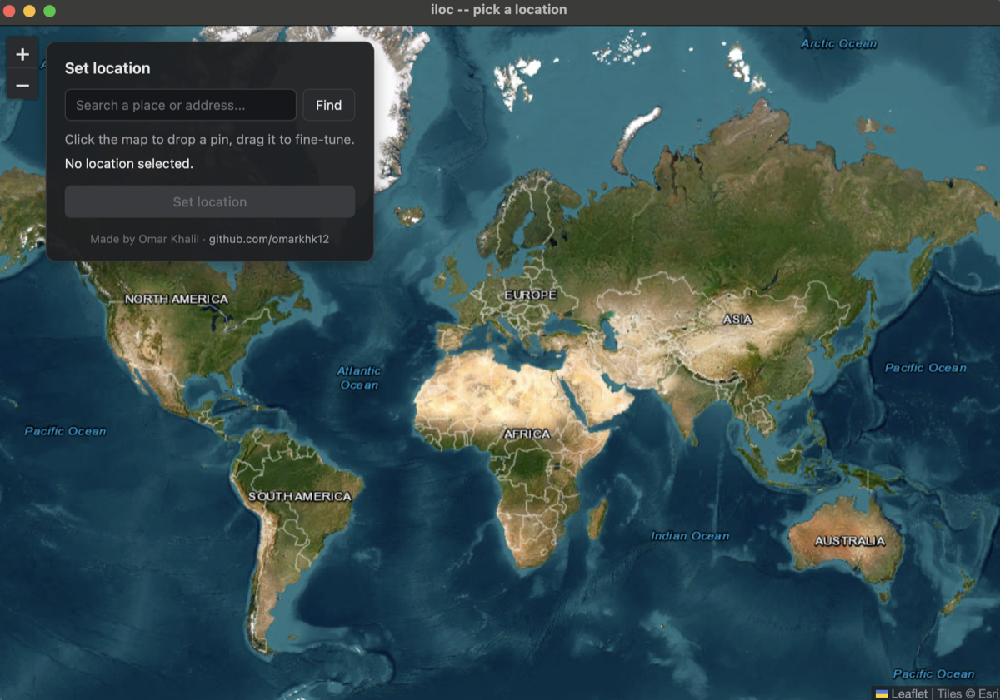

# iloc

A command-line tool to simulate the GPS location a connected iPhone reports,
using Apple's own developer/debugging services (the same mechanism Xcode and
Instruments use to test location-aware apps). Built as a cybersecurity
learning project to understand how iOS device communication, pairing, and
developer tooling actually work under the hood.

```
sudo iloc set 40.7128 -74.0060   # iPhone now reports being in NYC
iloc status                      # check what's currently simulated
sudo iloc clear                  # back to real GPS
```

## Scope and ethics

This tool only works on a device that:
- is physically connected to your Mac over USB,
- has explicitly enabled Developer Mode (a deliberate, on-device opt-in),
- has an existing trust/pairing relationship with your Mac.

It does not work remotely, silently, or against a device you don't control.
Use it only on your own device, or a device you have explicit authorization
to test. Location simulation can violate the Terms of Service of individual
apps (games, ride-share, etc.) even when used on your own hardware -- that's
between you and the app, not something this tool tries to hide or bypass.

## How it works

### The problem: talking to an iPhone at all

An iPhone doesn't expose a general-purpose network API to a connected
computer. Instead, macOS runs a background daemon called **usbmuxd** (also
used internally by Finder, Xcode, and iTunes) that "multiplexes" a single USB
connection into multiple virtual ports, each corresponding to a different
service on the phone (app installs, backups, syncing, etc.). `iloc` is built
on [pymobiledevice3](https://github.com/doronz88/pymobiledevice3), a
pure-Python reimplementation of Apple's private `usbmuxd`/`lockdownd`
wire protocols -- reverse-engineered, not sanctioned by Apple, but using the
same protocol Xcode itself speaks.

### Two separate trust gates

Getting from "cable plugged in" to "can simulate a location" requires two
independent layers of consent, both established once per Mac/device pair:

1. **Pairing ("Trust This Computer")** -- a cryptographic keypair exchanged
   between the Mac and the phone. This is required for *any* tool to talk to
   the phone's `lockdownd` services at all (basic info, backups, app
   installs).
2. **Developer Mode** -- a separate, explicit iOS setting introduced because
   debugging/instrumentation services became a real attack surface. Even a
   fully paired host is refused access to developer services until this is
   turned on, on the device, with a passcode confirmation after a reboot.

   The catch: on a device that's never had Developer Mode touched before,
   **the toggle doesn't even exist yet** in Settings -> Privacy & Security --
   it stays hidden until a paired host explicitly asks iOS to reveal it. Run
   this from your Mac first:
   ```bash
   python3 -m pymobiledevice3 amfi enable-developer-mode
   ```
   Then reboot the iPhone -- only after that will Settings -> Privacy &
   Security show a "Developer Mode" row at all, which you then toggle on and
   confirm (with your passcode) after a second reboot.

### The iOS 17+ tunnel (RemoteXPC)

Starting with iOS 17, Apple moved developer services (Instruments/DVT,
`debugserver`, XCUITest infra, etc.) off the old "just ask lockdownd" model
onto **RemoteXPC over a CoreDevice tunnel**. A tool can no longer connect to
these services directly -- it first has to establish a tunnel (a real
virtual network interface on the Mac, which is why this requires root), and
then reach services through that tunnel's address.

`iloc set`/`iloc clear` handle this by shelling out to pymobiledevice3's own
`lockdown start-tunnel` as a managed background process (reusing its
well-tested interface/routing setup rather than reimplementing that OS-level
plumbing), then talking to the actual location-simulation service
programmatically as a library.

### Location simulation itself

Once the tunnel is up, `iloc` opens a connection to
`com.apple.instruments.dtservicehub` -- the same DVT (DTX/Instruments)
service Xcode's Instruments app uses -- and specifically its
`com.apple.instruments.server.services.LocationSimulation` channel. This is
a **system-wide override**: once set, every app on the device (Maps,
navigation apps, anything using Core Location) sees the simulated
coordinates, not just a debugged process.

Critically, the override is tied to the *lifetime of that connection*. The
moment the connection closes, iOS reverts to the real GPS fix. That means
`iloc set` can't just fire a request and exit -- it spawns a small detached
background process (`iloc.holder`) that opens the connection, applies the
location, and holds it open until `iloc clear` terminates it (`SIGTERM` on
macOS/Linux; a plain process kill on Windows, since there's no cross-process
graceful-signal equivalent there). State (process IDs, the active tunnel's
address) is tracked in `~/.iloc/state.json` (`%USERPROFILE%\.iloc\state.json`
on Windows).

## Requirements

- macOS (with Xcode Command Line Tools), Linux, or Windows 10/11
- Python 3.10+
- An iPhone (tested on iOS 26) connected via USB, with Developer Mode enabled
- Elevated privileges for `set`/`clear` (to create the tunnel's network
  interface): `sudo` on macOS/Linux, an Administrator terminal on Windows

Windows note: the underlying tunnel/DVT libraries (`pymobiledevice3`,
`pytun-pmd3`'s bundled Wintun driver) support Windows, and `iloc`'s own
privilege/process-lifecycle code has been ported to work there too -- but
this hasn't yet been exercised against a real device on real Windows
hardware, only reviewed. `iloc pick` doesn't auto-elevate on Windows (there's
no inline `sudo` equivalent); it prints the `iloc set <lat> <lon>` command
for you to run from an Administrator terminal instead.

## Setup

```bash
python3 -m venv .venv
source .venv/bin/activate
pip install .
```

## Usage

```bash
sudo iloc set <latitude> <longitude>   # simulate a fixed location
iloc pick                              # choose a location visually on a map
iloc status                            # device info, Developer Mode, active simulation
sudo iloc clear                        # stop simulating, resume real GPS
```

`status` doesn't require `sudo` -- it only reads device/lockdown info and
this tool's own state file.

### Picking a location on a map

`iloc pick` opens a map window (search by place name or click/drag a pin)
instead of typing raw coordinates. It runs unprivileged for the GUI part,
then shells out to `sudo iloc set` once you confirm a point (see
[How it works](#how-it-works) for why).



## Project layout

```
src/iloc/
├── cli.py            # click-based command-line interface
├── simulate.py        # starts/stops the background location-holder process
├── holder.py           # the actual DVT connection; runs detached, holds it open
├── tunnel.py           # starts/reuses the sudo-created kernel tunnel
├── status.py           # device/simulation status queries
├── errors.py            # maps pymobiledevice3 failures to actionable messages
├── paths.py              # state file location (sudo-aware)
└── process_utils.py
```

## Acknowledgments

Built on top of [pymobiledevice3](https://github.com/doronz88/pymobiledevice3)
by doronz88 and contributors, which does the real work of speaking iOS's
device protocols.
